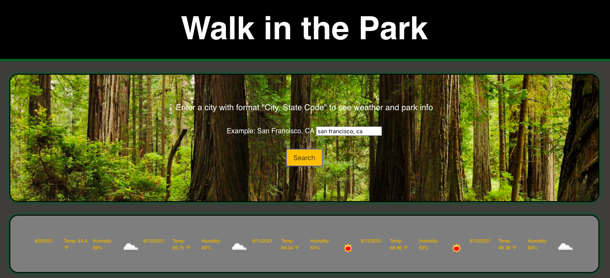
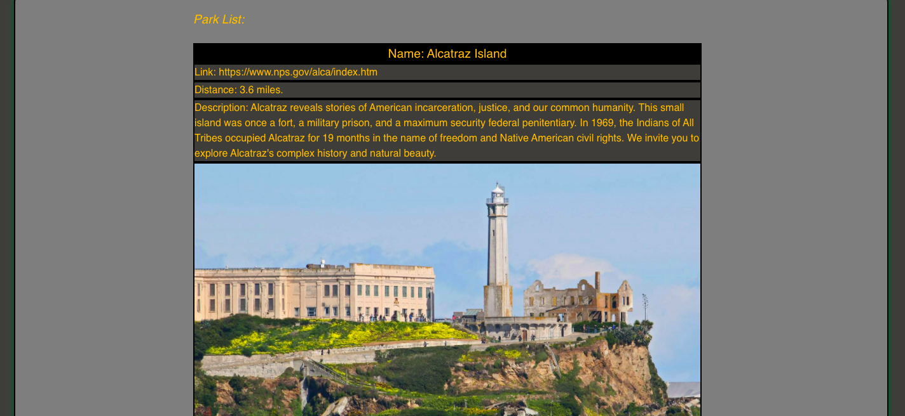

## Team Project: Walk-In-The-Park
A mobile first website that allows users see weather forecast and national parks in any city. Built with HTML, CSS, Bulma, JavaScript using jQuery, Moment, OpenWeather API, and National Park API.

When a user enters a city name in the search box
* Then they are presented with weather forecast for the next 5 days (temperature, wind, rain)
* They are also presented with a list of parks in or near the city (park name, picture, description)

## Challenges:
Finding the right API that gives us the data we need while being free, and quick to get license. 
The National Park API shows all parks in the state while only results within a certain distance from the city are needed. Resolved by adding filters and conditions to the responses.

## Screenshots

    </img>
    </img>

## Deployed URL
https://minhhap.github.io/walk-in-the-park/

## Contributors 
Haniel Chang, Kyle Kilmartin, MinhHa Pham, Daniel Snowden